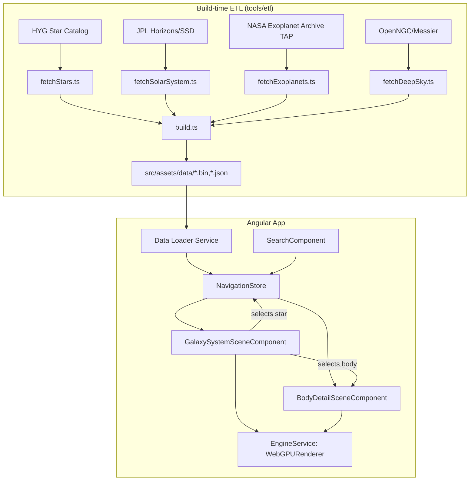

# Requirements

### Overview & Goals
Build an interactive, web-based 3D star map in the visual style of Star Citizen's in-game starmap, but populated with **real NASA/astronomical data** instead of fictional systems. Users can browse a galaxy-scale view of nearby stars, drill into an individual star system to see its planets, and inspect a specific body (planet/moon/exoplanet) in detail.

This is a **greenfield project** — the current `star-map` repo only contains an unrelated Claude Code plugin marketplace (agents/commands/skills), so there is no existing app code to build on.

### Scope
**In Scope**
- Angular web app rendering a 3D scene with Three.js (`WebGPURenderer`, TSL node materials, automatic WebGL2 fallback).
- Build-time ETL pipeline that fetches NASA/astronomy data sources once and bakes them into static assets:
  - Nearby stars (HYG database — combined Hipparcos/Yale/Gliese catalog) → galaxy-scale star field.
  - Solar-system bodies (JPL Horizons/SSD) → orbital elements for planets/moons.
  - Exoplanets (NASA Exoplanet Archive, Planetary Systems TAP table) → attached to host stars.
  - Deep-sky objects (nebulae/galaxies, e.g. OpenNGC/Messier) → galaxy-view backdrop.
- Galaxy overview: node/point field of stars, pan/zoom/rotate camera, click-to-select, labels.
- System drill-down: orbit ellipses and planet/exoplanet markers computed from orbital elements, reached via a continuous camera-flight transition from the galaxy view.
- Body detail view: focused scene + info panel for a selected planet/moon/exoplanet (radius, mass, orbital data, NASA facts).
- Search/filter UI to jump directly to a star, system, or body.

**Out of Scope**
- Live/runtime querying of NASA APIs from the browser (data is pre-baked at build time).
- Gameplay mechanics (travel time, fuel, missions) — this is an exploration/visualization tool, not a game.
- User accounts, persistence, or multiplayer features.
- Full Gaia catalog (millions of stars) — HYG's curated subset is used for performance.

### User Stories
- As a space enthusiast, I want to see a 3D map of nearby real stars so I can explore the stellar neighborhood the way I'd explore Star Citizen's map.
- As a user, I want to click a star and zoom smoothly into its system to see its real planets and exoplanets.
- As a user, I want to click a planet/moon to see detailed real NASA data about it.
- As a user, I want to search for a star or planet by name and jump straight to it.
- As a user, I want visual cues (glow, size, color) that reflect real stellar/planetary properties (spectral type, magnitude, radius).

### Functional Requirements
- Galaxy view renders all HYG stars within a reasonable distance (e.g. ≤ a few hundred light-years) as an interactive point/instanced field with correct relative 3D positions derived from RA/Dec/distance.
- Selecting a star triggers a camera-flight transition into that system's view (not an instant scene swap) for a fluid, Star-Citizen-like feel.
- System view renders the star, its planets (from JPL orbital elements) and any known exoplanets, with orbit paths drawn as ellipses.
- Selecting a body opens a body-detail view/route with a dedicated scene and an info panel of real data.
- Search returns matches across stars, planets, and exoplanets by name and navigates to the correct view.
- The app must run in a modern browser without a WebGPU-capable GPU (auto-fallback to WebGL2 via `WebGPURenderer`).

### Non-Functional Requirements
- Initial star-field load should be fast; star position data is delivered as a compact binary buffer, not verbose JSON, to keep payload size and parse time low.
- Rendering must stay interactive (target 60fps on mid-range hardware) for the galaxy view's star count.
- ETL pipeline is re-runnable (idempotent) so data can be refreshed periodically without code changes.

# Technical Design

### Current Implementation
The repository currently contains only an unrelated Claude Code plugin marketplace (`agents/`, `commands/`, `skills/`, `README.md`). There is no existing frontend, backend, or data pipeline code — this design starts from a clean slate and defines the initial project structure.

### Key Decisions
1. **Rendering stack**: Angular + Three.js `WebGPURenderer` using TSL (Three.js Shading Language) node materials. `WebGPURenderer` automatically falls back to a WebGL2 backend when WebGPU is unavailable, so this is chosen over the legacy `WebGLRenderer` to be future-aligned while keeping broad compatibility. Rendering runs inside `NgZone.runOutsideAngular()` to avoid change-detection overhead on every animation frame.
2. **Data pipeline**: Build-time static ETL (chosen over a runtime backend). A standalone Node/TS script (`tools/etl`) fetches all NASA/astronomy sources once (or on a schedule) and writes optimized static assets (`src/assets/data/`) that the Angular app loads directly — no backend server required at runtime.
3. **Zoom/navigation architecture**: Hybrid model. Galaxy view and System view share **one continuous scene and camera** that flies smoothly between the two scales (matching Star Citizen's fluid zoom). Body-detail view is a **separate, focused scene/route**, since its content (a single close-up object) and camera needs are unrelated to the galaxy/system camera rig.
4. **Multi-scale coordinate handling**: Galaxy view operates in parsecs, System view in AU — roughly an 8-order-of-magnitude difference that causes floating-point precision and clipping problems if rendered naively in one Three.js unit space. Solution: maintain two independent coordinate scales (`galaxy-scale` and `system-scale`) with a re-centering ("floating origin") step on every camera-driven scale transition — the active system's star is recentered to the origin before switching the camera's near/far planes and unit scale, avoiding z-fighting/jitter at either extreme.
5. **Planet positions are computed, not fetched live**: JPL data provides orbital elements (semi-major axis, eccentricity, inclination, etc.), not per-frame positions. Positions are derived client-side via a simplified Kepler propagator against an app-level "current epoch" value, which also allows optional time-scrubbing later.

### Data Pipeline (ETL)
`tools/etl/` (Node + TypeScript, run via `npm run etl`):
- `fetchStars.ts` — downloads the HYG database (Hipparcos/Yale/Gliese combined catalog), converts RA/Dec/parallax → Cartesian XYZ (parsecs), filters by distance cutoff, packs into a binary `Float32Array` buffer (`stars.bin`) + a small `stars-index.json` (id, name, spectral type, magnitude, buffer offset).
- `fetchSolarSystem.ts` — queries JPL Horizons/SSD for planets/major moons, extracts orbital elements, writes `bodies.json`.
- `fetchExoplanets.ts` — queries the NASA Exoplanet Archive TAP service (`Planetary Systems` table) for confirmed exoplanets + host star coordinates, cross-references host stars to the HYG index by name/coordinates, writes `exoplanets.json`.
- `fetchDeepSky.ts` — pulls a nebula/galaxy catalog (OpenNGC/Messier) with RA/Dec/distance, writes `deepsky.json`.
- `build.ts` — orchestrates the above and validates output (no missing cross-references, reasonable file sizes).
- Output lands in `src/assets/data/` and is committed/regenerated like any other static asset.

### Data Models / Contracts
```ts
interface StarRecord {
  id: number;
  name: string;
  x: number; y: number; z: number; // parsecs, galaxy-scale, Sun at origin
  magnitude: number;
  spectralType: string;
  colorIndex: number;
}

interface OrbitalElements {
  semiMajorAxisAu: number;
  eccentricity: number;
  inclinationDeg: number;
  longitudeOfAscendingNodeDeg: number;
  argumentOfPeriapsisDeg: number;
  meanAnomalyAtEpochDeg: number;
  epochJd: number;
}

interface BodyRecord {
  id: string;
  systemStarId: number;
  name: string;
  kind: 'planet' | 'moon' | 'dwarf';
  radiusKm: number;
  orbit: OrbitalElements;
}

interface ExoplanetRecord {
  id: string;
  hostStarId: number | null; // null if not cross-referenced
  name: string;
  radiusEarth?: number;
  massEarth?: number;
  orbit: Partial<OrbitalElements>;
}

// Revised during implementation: OpenNGC publishes no distance column, and the redshift/
// parallax fallbacks both fail for the best-known objects (M31/M33/M42 are Local Group
// members with negative or absent redshift; a galaxy's catalog parallax comes from a
// cross-matched foreground star). The line of sight is always known, so these are stored as
// unit directions and drawn on a fixed backdrop shell, with distance as optional metadata.
// See `shared/models/deepsky.model.ts`.
interface DeepSkyRecord {
  id: string;
  name: string;
  kind: 'nebula' | 'galaxy' | 'cluster';
  x: number; y: number; z: number; // unit vector on the celestial sphere, not a position
  angularSizeDeg: number;
  magnitude: number | null;
  distancePc: number | null;
  distanceMethod: 'parallax' | 'redshift' | null;
  constellation: string;
  messier: string | null;
}
```

### Components
- `EngineService` (`core/engine/engine.service.ts`) — owns the Three.js `WebGPURenderer`, the render loop (outside `NgZone`), and resize handling. Injected once per canvas host.
- `GalaxySystemSceneComponent` — hosts the shared continuous scene for Galaxy + System views; owns `CameraRigController` that animates between galaxy-scale and system-scale framing (the floating-origin recenter step lives here).
- `StarFieldRenderer` — builds a `THREE.Points`/instanced mesh from `stars.bin` with a TSL-based glow/color node material driven by magnitude and spectral type.
- `SystemOrbitsRenderer` — draws orbit ellipses and planet/exoplanet markers for the currently focused star system, using the Kepler propagator.
- `KeplerPropagator` (`shared/astro/kepler.ts`) — pure function(s) converting `OrbitalElements` + epoch → Cartesian position; independently unit-testable.
- `BodyDetailSceneComponent` — separate route/component with its own dedicated scene for a close-up view of one selected body, plus an `InfoPanelComponent` showing its data.
- `planet-appearance.ts` / `stellar.ts` (`shared/astro/`) — derives a host star's luminosity from its catalogued magnitude and distance, a planet's equilibrium temperature and bulk density from that, and a class of world from those.
- `procedural-planet-texture.ts` (`shared/rendering/`) — paints an equirectangular surface from that derivation: zonal bands for a fluid envelope, fractal terrain for a solid one, polar caps sized by temperature. A pure function over a byte array, no canvas.
- `SearchComponent` — text search across `stars-index.json`, `bodies.json`, `exoplanets.json`; on match, dispatches a navigation action.
- `NavigationStore` (Angular signals-based) — holds `viewLevel: 'galactic' | 'galaxy' | 'system'`, `selectedStarId`, `selectedBodyId`; consumed by scene components and routed body-detail view.
- `MilkyWayRenderer` / `milky-way-model.ts` — the Galaxy itself as an instanced particle cloud scattered around the structural model in `shared/astro/galaxy.ts`, crossfaded against the catalogued star field by camera distance.
- `PolarGridPlane` / `TetherField` (`grid-plane.ts`) — the reference plane a view is read against: rings and spokes lying in a given plane, plus drop lines onto it. Used at all three scales — the galactic plane, the Sun's plane, and each system's own orbital plane.
- `StarmapHudComponent` — the heads-up display: scale ladder, readout panel, range, reticle and frame.

### File Structure
```
tools/
  etl/
    fetchStars.ts
    fetchSolarSystem.ts
    fetchExoplanets.ts
    fetchDeepSky.ts
    build.ts
src/
  assets/data/
    stars.bin
    stars-index.json
    bodies.json
    exoplanets.json
    deepsky.json
  app/
    core/
      engine/
        engine.service.ts
    features/
      galaxy-system/
        galaxy-system-scene.component.ts
        star-field-renderer.ts
        system-orbits-renderer.ts
        camera-rig-controller.ts
      body-detail/
        body-detail-scene.component.ts
        info-panel.component.ts
      search/
        search.component.ts
    shared/
      astro/
        kepler.ts
        coordinates.ts
      models/
        star.model.ts
        body.model.ts
        exoplanet.model.ts
        deepsky.model.ts
      state/
        navigation.store.ts
```

### Architecture Diagram


### Risks
- **WebGPURenderer + TSL maturity**: the node-material pipeline is still evolving; some effects (custom shaders, post-processing) may need TSL rewrites rather than legacy `ShaderMaterial`. Mitigated by relying mostly on built-in node materials for stars/orbits.
- **Float precision at galaxy scale**: mitigated via the floating-origin recenter strategy described in Key Decisions.
- **Data cross-referencing**: exoplanets from the Exoplanet Archive must be matched to HYG host stars by name/coordinates; some may fail to match and should be flagged rather than silently dropped (`hostStarId: null`).
- **NASA API rate limits/availability**: ETL scripts should cache raw responses locally so re-runs don't always hit live endpoints.

# Testing

### Validation Approach
Since this is a new build, validation focuses on (a) correctness of the astronomical math and ETL output, and (b) the interactive scene behaving as specified.

### Key Scenarios
- ETL `build.ts` run produces `stars.bin`/`stars-index.json`/`bodies.json`/`exoplanets.json`/`deepsky.json` with no missing/undefined required fields.
- `coordinates.ts` RA/Dec/parallax → XYZ conversion matches known reference values (e.g. Sirius, Proxima Centauri positions) within a small tolerance.
- `kepler.ts` propagator reproduces expected planet positions for simple test cases (e.g. Earth's position at a known epoch) within tolerance.
- Clicking a star in the galaxy view triggers a camera-flight transition and lands in the correct system view (`NavigationStore.viewLevel === 'system'` and `selectedStarId` set).
- Selecting a body navigates to `BodyDetailSceneComponent` with the correct `selectedBodyId` and populated info panel.
- Search returns and navigates to the correct entity for star/body/exoplanet name queries.

### Edge Cases
- Exoplanets whose host star can't be matched to a HYG record (`hostStarId: null`) are excluded from system view but don't crash the app.
- Systems with zero known planets/exoplanets still render (star only, no orbit renderer errors).
- WebGPU unavailable in the test browser: renderer falls back to WebGL2 without throwing.

### Test Changes
- Unit tests (Jest/Karma per Angular defaults) for `coordinates.ts` and `kepler.ts` pure functions.
- Unit tests for ETL cross-referencing logic (`fetchExoplanets.ts` host-star matching) using mocked API fixtures.
- Component tests for `NavigationStore` state transitions (galaxy → system → body).

# Delivery Steps

### ✓ Step 1: Scaffold Angular project and Three.js WebGPU rendering foundation
An Angular app boots and renders an empty Three.js scene via WebGPURenderer with automatic WebGL2 fallback.
- Generate the Angular workspace (standalone components, routing enabled) with `src/app/core`, `features`, `shared` folders per the agreed file structure.
- Implement `EngineService` that creates a `THREE.WebGPURenderer`, a base `Scene`/`PerspectiveCamera`, and a render loop running via `NgZone.runOutsideAngular()`.
- Implement a canvas host component that attaches the renderer to a `<canvas>` and handles resize.
- Add a placeholder starfield (procedural points) just to prove the render loop, camera, and resize logic work end-to-end.

### ✓ Step 2: Build the NASA/astronomy data ETL pipeline
Running `npm run etl` produces the static data files consumed by the app.
- Implement `tools/etl/fetchStars.ts` to download the HYG catalog and convert RA/Dec/parallax to XYZ (parsecs) via `shared/astro/coordinates.ts`, packing results into `stars.bin` + `stars-index.json`.
- Implement `tools/etl/fetchSolarSystem.ts` to pull orbital elements for solar-system bodies from JPL Horizons/SSD into `bodies.json`.
- Implement `tools/etl/fetchExoplanets.ts` to query the NASA Exoplanet Archive TAP `Planetary Systems` table and cross-reference host stars to the HYG index, writing `exoplanets.json`.
- Implement `tools/etl/fetchDeepSky.ts` for nebula/galaxy catalog data into `deepsky.json`.
- Implement `tools/etl/build.ts` to orchestrate all fetch scripts, cache raw API responses, and validate output completeness.

### ✓ Step 3: Implement the galaxy view star field with selection and labels
Users can pan/zoom/rotate a real star field and click a star to select it.
- Implement `StarFieldRenderer` to load `stars.bin`/`stars-index.json` and build an instanced/points mesh with a TSL node material driving glow/color from magnitude and spectral type.
- Implement camera pan/zoom/rotate controls for the galaxy scale.
- Implement picking (raycast or GPU picking) to select a star on click, updating `NavigationStore.selectedStarId`.
- Implement label overlays (CSS2D or DOM overlay) showing star names near the camera focus.

### ✓ Step 4: Implement system view and the galaxy-to-system camera transition
Selecting a star flies the camera smoothly into that system, showing its real planets and orbits.
- Implement `shared/astro/kepler.ts` Kepler propagator converting `OrbitalElements` + epoch to Cartesian position.
- Implement `SystemOrbitsRenderer` to draw orbit ellipses and planet/exoplanet markers for the star in `NavigationStore.selectedStarId`, loading matching records from `bodies.json`/`exoplanets.json`.
- Implement `CameraRigController` with the floating-origin recenter step and animated transition between galaxy-scale and system-scale framing.
- Wire `NavigationStore.viewLevel` toggling between `'galaxy'` and `'system'` to drive `GalaxySystemSceneComponent`.

### ✓ Step 5: Implement the body detail view and info panel
Selecting a planet/moon/exoplanet opens a dedicated close-up scene with real data.
- Implement `BodyDetailSceneComponent` as a separate route with its own `EngineService`-backed scene focused on one selected body.
- Implement `InfoPanelComponent` displaying the body's real data (radius, mass, orbital elements, kind).
- Wire body selection from `SystemOrbitsRenderer` to update `NavigationStore.selectedBodyId` and navigate to the body-detail route.

### ✓ Step 6: Implement search and cross-view navigation
Users can search by name and jump directly to the matching star, system, or body.
- Implement `SearchComponent` querying `stars-index.json`, `bodies.json`, and `exoplanets.json` for name matches.
- On selecting a search result, dispatch the appropriate `NavigationStore` update (galaxy star, system body, or exoplanet) and trigger the corresponding camera transition or route change.
- Ensure consistent state across `GalaxySystemSceneComponent` and `BodyDetailSceneComponent` when navigation originates from search rather than in-scene clicks.

### ✓ Step 7: Add the galactic scale and the heads-up display
The map opens out from the catalogued neighbourhood to the whole Milky Way, in the visual language of the reference.
- Add `shared/astro/galaxy.ts`: the galactic↔equatorial rotation, the Sun's galactocentric position, and logarithmic-spiral parameters per arm.
- Add `MilkyWayRenderer`, crossfaded against the star field by camera distance so the two scales share one continuous parsec space rather than being separate scenes.
- Add the galactic and local grid planes, star tethers, and the HUD (scale ladder, readout panel, range, reticle, frame).
- Label the Galaxy model as a model wherever it is shown: its skeleton is measured, its particles are not.

### ✓ Step 8: Put a reference grid under the system view
The same plane-and-tether reading aid the outer scales got, applied to a single system.
- Add `systemGridRingsAu`: ring radii snapped to a 1-2-5 ladder so a distance can be read off, at any of the four orders of magnitude real systems span.
- Draw the grid and the body tethers in the system's own reference plane — the ecliptic for the solar system, the plane of the sky otherwise — dashed, so it is never mistaken for an orbit.
- Frame the camera against that same plane, so an exoplanet system is presented face-on rather than edge-on.

### ✓ Step 9: Give every body a surface
Real photography where it exists, and a surface reasoned from measurements where it does not.
- Derive host-star luminosity from apparent magnitude, parallax distance and a bolometric correction; validate against published values for real stars.
- Derive equilibrium temperature and bulk density from it, and classify each world by size, temperature and density; validate against the solar system's own bodies.
- Paint the surface procedurally from that class, seeded per body so it is stable between visits, and apply it in both the body-detail view and the system-view markers.
- State the derivation and its limits on screen, next to the measurements it rests on.

### ✓ Step 10: Frame the system view from the camera it actually has
- Replace the fixed distance-to-outermost-orbit multiple with a distance derived from the camera's vertical field of view and aspect, so what fits is a radius on screen rather than a guess.
- Frame against the reference grid's outer ring, which is always wider than the outermost orbit, and leave an explicit margin around it.
- Raise the framing ceiling far enough to hold the solar system out to Pluto in a portrait window; only companions hundreds of AU out reach it now.
- Floor the star's halo against the framed radius, so a star sized against its innermost orbit still reads at the distance that frames its outermost one.

### ✓ Step 11: Widen the star catalogue, and separate what is drawn from what is known
- Repack the catalogue as two binary column stores plus a string-only JSON index (`star-catalog.ts`, shared by the ETL and the app), so 7.8x the stars costs 1.7x the bytes instead of 12x.
- Raise the distance cutoff from 50 pc to 250 pc — where Hipparcos parallaxes stop being trustworthy — taking the catalogue from 8750 stars to 68388.
- Give the star field a render budget: every star inside 25 pc plus the brightest of the rest. Search, navigation and the cross-reference still see the whole catalogue.
- Store each exoplanet's host coordinates and re-resolve the cross-reference against the current catalogue at build time, so widening the star list rescues systems without re-downloading the archive. Renderable systems: 371 to 609.
