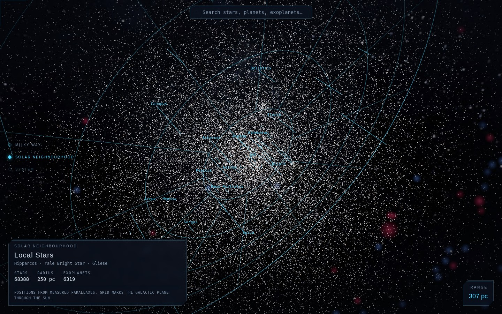
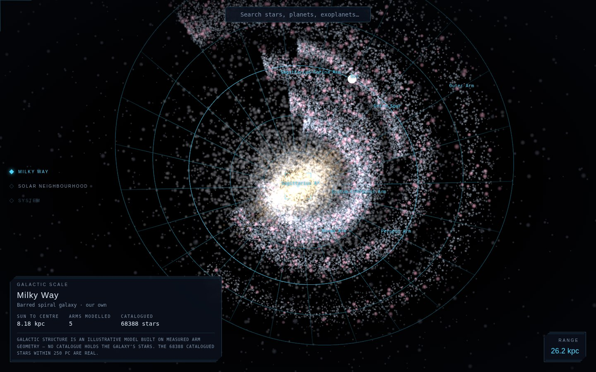
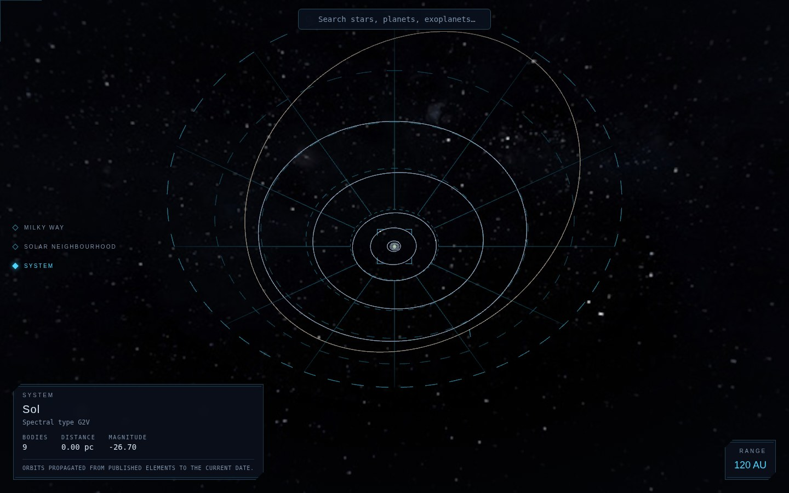
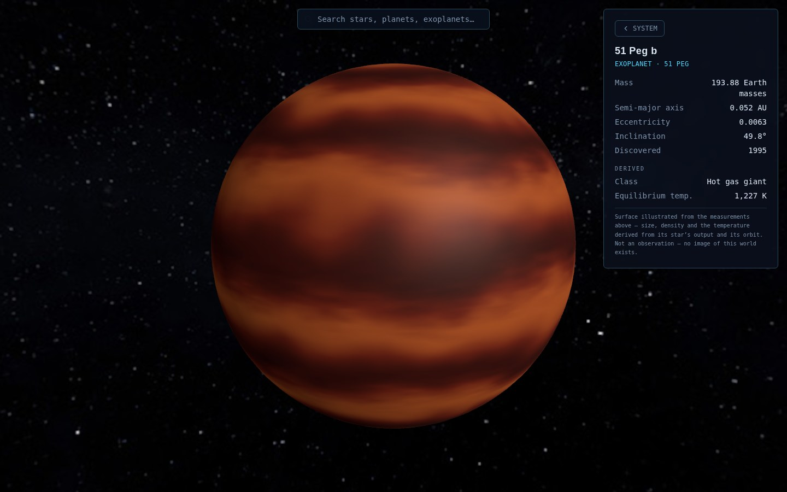

# star-map

An interactive 3D star map in the spirit of Star Citizen's in-game starmap, but populated with
real astronomical data instead of fictional systems. Browse the solar neighbourhood, fly into a
star's system to see its planets on their real orbits, and drill into a single body for the
NASA figures behind it.

**Live at <https://avalon-vanguard.github.io/star-map/>**, published from `main` by
[`.github/workflows/pages.yml`](.github/workflows/pages.yml). There is no backend — the whole
thing is static files and a few megabytes of baked catalogue.

The source of a small Claude Code plugin also lives here — see [Plugins](#plugins) below.



## Running it

```bash
npm install
npm start          # dev server on http://localhost:4200
npm run build      # production bundle into dist/
```

Requires the Node version in `package.json`'s Angular toolchain range (Node 22.22.3+ or 24.15+).

```bash
npm test               # unit/component tests (Vitest, jsdom)
npm run e2e            # end-to-end tests (Playwright + Chromium) — see e2e/README.md
npm run etl            # refresh the astronomical datasets — see below
npm run etl:typecheck  # type-check the ETL scripts (they build separately from the app)
npm run e2e:typecheck
```

## What's in it

**Galaxy view** — the HYG catalogue out to 250 parsecs, 68 388 stars, as instanced
camera-facing billboards positioned from real RA/Dec/parallax, coloured by spectral index and
sized by magnitude — all of them drawn, in one instanced call, with a budget in reserve for
catalogues larger than a GPU should be asked to hold at once (see "On how many stars" below). A
polar grid in the galactic plane runs under them with a drop line from each of the brightest,
and names label the most prominent stars near whatever the camera is looking at. Behind them
sits a backdrop of notable deep-sky objects and a Milky Way panorama.



**Galactic view** — keep pulling back and the neighbourhood becomes a point inside the Milky
Way: the bar and bulge, five spiral arms, the disc and a thin halo, with the arms and the
galactic centre named. It is the same parsec-scale space as the galaxy view, crossfaded by
camera distance rather than switched, so the Sun stays where it really is — 8.18 kpc out, on the
Orion Spur, between the Sagittarius and Perseus arms. See "On the Galaxy model" below for what
in it is measured and what is not.



**System view** — selecting a star flies the camera continuously into its system rather than
cutting to a new scene. The Sun gets the real solar-system bodies from JPL Horizons; other
stars get their confirmed exoplanets. Orbits are drawn as ellipses and bodies are propagated
along them by a Kepler solver against the current epoch. Under them, a dashed grid marks out
round distances in AU — 5 AU rings for the solar system, 0.01 AU rings for TRAPPIST-1 — with a
drop line from each body, so eccentricity and inclination read against a circular reference
instead of having to be inferred from a shape in space. The camera frames that grid rather than
the orbits, from the field of view it actually has, so the outermost ring sits inside the frame
with room around it at any system scale and any window shape.

The star at the centre is sized against the system's *innermost* orbit, so it can never swallow
its closest planet, while the camera is placed to frame the *outermost* ring — and in the solar
system those differ by a factor of a hundred. At the distance that fits Pluto in view, a disc
that stays clear of Mercury is about a pixel across, and no radius satisfies both. So the disc
stays honest to the orbits and the star's halo carries its visibility, floored against the framed
radius: light is not a surface, and a glow reaching past the innermost orbit says the star is
bright rather than that it is large. That floor is bounded from both sides — large enough that
the star reads at a glance, small enough that Venus's and Earth's orbits stay legible as rings
around it. Mercury's, three pixels wide at that range, does not survive either way.



**Body detail** — a dedicated close-up scene and info panel for one planet, moon or exoplanet,
with real photography where NASA/ESA/USGS imagery exists, and a surface derived from the body's
own measurements where it does not. See "On surfaces that were never photographed" below.

**Object card** — hovering a body in the system view raises its figures over the live scene and
clicking pins them, so two planets can be compared without flying out and back; **Full view**
opens the detail route when the close-up is wanted. The card and the detail panel are built from
one shared view model and one shared set of readouts, which is what stops the same planet reading
255 K in one and 254 K in the other.

**Measured against derived** — every figure is filed under the heading it earns. A published
radius is measured; an equilibrium temperature computed from the host star's luminosity is
derived, and says so. Orbital period is shown where it can honestly be had: for a heliocentric
orbit it follows exactly from the semi-major axis, because in these units the Sun's mass *is* the
unit of mass — Mars comes back 687.0 d against a published 686.98. It is deliberately absent for
moons, whose elements are relative to a parent planet the catalogue carries no mass for, and for
exoplanets, where assuming a solar-mass host would mis-state every planet around an M dwarf.

**Search** — name search across stars, solar-system bodies and exoplanets, navigating to the
same place an in-scene click would.

Screenshots are captured from a real run of the app at `docs/screenshots/`, and are regenerated
when the views they show change — the galactic one above records the catalogue size and reach in
its own readout, so a stale image is visible as one.

### Architecture notes

- **Rendering** runs on Three.js `WebGPURenderer`, which falls back to a WebGL2 backend
  automatically. The render loop runs outside Angular's change detection.
- **Stars are billboards, not points.** The WebGPU backend caps point primitives at a single
  pixel, so a points cloud renders every star as an identical dot regardless of magnitude. The
  star field is instanced quads on a `SpriteNodeMaterial` instead, which behaves the same on
  both backends. Their size is angular rather than world-space — real stars are unresolvable
  point sources, so apparent size should follow brightness, not distance.
- **One reference frame, from three sources.** HYG gives star positions in equatorial J2000.
  JPL Horizons reports orbital elements against the ecliptic, tilted 23.4° away. The Exoplanet
  Archive measures inclination from the *plane of the sky* — perpendicular to our line of sight
  to each host star, which is why transiting planets cluster at 90°. Each set of elements is
  rotated from its own reference plane into the scene's equatorial frame, so a direction means
  the same thing everywhere. Systems are still presented face-on — by placing the camera
  relative to whichever plane that system's elements were measured in, rather than by rotating
  the world into a convenient pose. That plane is per-system, not global: one fixed viewing
  direction is face-on for the solar system and edge-on for an exoplanet system whose host star
  lies elsewhere on the sky. It is also the plane the system's reference grid lies in.
- **Two coordinate scales.** The galaxy view works in parsecs and the system view in AU —
  about eight orders of magnitude apart, which wrecks float precision if rendered in one unit
  space. The camera rig recentres the active star to the origin ("floating origin") and swaps
  the unit scale and near/far planes at the transition point.
- **The galactic scale is not a third space.** It is the same parsec space as the galaxy view,
  four orders of magnitude further out, so no swap is needed — the Milky Way model and the
  catalogued star field crossfade against camera distance and the depth range scales with it.
  One fixed near/far pair cannot serve both ends: flying into a star needs a near plane a
  hundredth of a parsec out, and holding the Galaxy needs a far plane a hundred thousand
  parsecs out, and a projection spanning both has no precision left to separate one arm from
  the next.
- **No backend.** Every dataset is baked at build time into `src/assets/data/` and served as a
  static asset. Nothing queries an astronomy API at runtime.

### On surfaces that were never photographed

Fifteen bodies here have a real photograph. Everything else does not, and never will on current
instruments: no exoplanet's surface has ever been imaged, and a few of the solar system's own
moons have no usable map in this asset set either.

Those bodies get a surface reasoned from what *has* been measured, in a chain that is worth
following because every link is standard:

1. The host star's **luminosity** comes from its catalogued apparent magnitude and its
   parallax distance — that pair is exactly an absolute magnitude — plus a bolometric correction
   for its spectral class. The correction is not optional: an M dwarf radiates most of its light
   in the infrared, so its visual magnitude understates it by more than tenfold, and M dwarfs are
   what most nearby planet hosts are. Good to about a factor of two, which matters less than it
   sounds: temperature goes as the fourth root.
2. Luminosity and the planet's semi-major axis give its **equilibrium temperature**, the standard
   blackbody balance. Checked against the solar system it lands on Earth 255 K, Jupiter 112 K,
   Neptune 46 K — all within a kelvin or two of published values — and puts 51 Pegasi b at
   1227 K against a published 1200.
3. Published mass and radius give **bulk density**, which is the difference between a ball of
   iron, of rock, of water and of hydrogen.
4. Size fixes the family, temperature the state within it, and density overrides both at the
   extremes. That yields a class — molten, scorched, iron-rich, rocky, temperate, ice, sub-
   Neptune, ice giant, gas giant, hot gas giant — each with a palette reasoned from its chemistry.
   Methane absorbs red light, which is why the ice giants are blue; ammonia cloud tops are cream
   and ochre; silicate cloud decks over a glowing interior are why hot Jupiters are drawn deep red.
5. The surface is then painted from that class: **zonal bands** for a body with a fluid envelope,
   because a rapidly rotating atmosphere organises into them, and fractal **terrain** for one
   with a solid surface. Polar caps grow and shrink with the derived temperature.

The generator samples three-dimensional noise along the sphere rather than a flat field, so
there is no seam to stitch at the antimeridian and no pinching at the poles, and it writes into
a plain byte array rather than a canvas — which makes it a pure function with no DOM to depend on.
Each body's surface is seeded from its own id, so it looks the same on every visit.

The limits are worth stating. Equilibrium temperature ignores greenhouse warming and internal
heat, which is why Venus comes out at 300 K against a real surface of 737 K, and why Io — kept
molten by tidal heating — classifies as ice. Luminosity classes are often missing from the star
catalogue, so a red giant read as a dwarf will come out too bright. And the surfaces are
illustrations throughout: the info panel says so on every body that has one, next to the
measurements it was reasoned from.

### On the Galaxy model

Every other dataset here is measured. The Galaxy is the exception, and not for want of trying:
we sit inside its disc, and dust blocks the view across it, so no catalogue holds the positions
of its stars. Every rendering of the Milky Way seen face-on — including NASA's — is a model.

What *is* measured is the skeleton, and that is what `shared/astro/galaxy.ts` contains: the
directions of the galactic centre and the north galactic pole, which fix the disc's 63° tilt
against the celestial equator; the 8.18 kpc from the Sun to the centre, from the orbit of the
star S2 around Sgr A*; and a reference radius, azimuth and pitch angle per spiral arm,
approximating the maser-parallax fits. The Sun's placement on the Orion Spur and the arms either
side of it follow from those numbers rather than being posed by hand.

The particles scattered around that skeleton are illustrative — a seeded, reproducible cloud, not
observations. The galactic view says so on screen, and the model fades out entirely before the
camera reaches the catalogued 50 pc the real stars occupy.

## Data pipeline

`npm run etl` runs `tools/etl/build.ts`, which fetches each source, writes the static assets,
then validates the combined output. Raw responses are cached under `tools/etl/.cache/`, so
re-runs are cheap and offline-friendly; set `ETL_FORCE_REFRESH=1` to bypass the cache.

| Script | Source | Output |
| --- | --- | --- |
| `fetchStars.ts` | HYG database, plus any other positional catalogue wired in (see below) | `stars.bin`, `stars-meta.bin`, `stars-index.json` |
| `fetchSolarSystem.ts` | JPL Horizons / SSD | `bodies.json` |
| `fetchExoplanets.ts` | NASA Exoplanet Archive (TAP) | `exoplanets.json` |
| `fetchDeepSky.ts` | OpenNGC | `deepsky.json` |

The star catalogue ships as two binary column stores plus a small JSON file, not as an array of
objects. At 68 388 stars the old encoding — one JSON object per star, its eight key names
repeated each time — would have been about 17 MB to download and parse before the first frame.
Splitting it puts the numbers in `stars.bin` (positions, handed to the GPU verbatim) and
`stars-meta.bin` (id, magnitude, colour index, spectral-type index), and leaves `stars-index.json`
holding only the strings, with the ~2 600 distinct spectral classifications collapsed into a
dictionary. The result is 2.6 MB for 7.8× the stars. `star-catalog.ts` defines the layout once
and both the ETL and the app use it, so the writer and the reader cannot drift apart.

`ETL_STAR_DISTANCE_PC` (default `250`) sets the star-field distance cutoff.

### On aggregating other surveys

`tools/etl/sources/registry.ts` lists every catalogue the pipeline knows about, and `npm run etl`
prints it. Sources are wired in by role, because the roles are not interchangeable:

| Source | Role | What it adds |
| --- | --- | --- |
| HYG | positional | The named, spectrally classified bright-star spine — 68 388 stars within 250 pc. |
| Gaia DR3 | positional | Parallaxes fifty times more precise, for 1.8 billion sources. |
| DECaPS2 | backdrop | 3.32 billion objects across the southern galactic plane. |
| SDSS-V Milky Way Mapper | enrichment | Spectroscopic temperatures, gravities, metallicities, radial velocities. |
| Euclid Bulge Survey (Q2) | backdrop | High-resolution imagery and astrometry of the inner bulge. |
| SAGA | enrichment | Compiled elemental abundances for metal-poor stars. |

The distinction that matters is not size — it is whether a catalogue knows how **far away** its
objects are, because a 3D map cannot place a star it only has a direction for. **Gaia is the only
one of these that can add stars to this map**, because it is the only one that measures
parallaxes. DECaPS2 has fifty times Gaia's object count and photometry alone: not one of its
3.32 billion objects can be placed in depth, so it can only ever be a direction-only backdrop
beside the deep-sky shell. Euclid's bulge sits 8 kpc away, where a parallax is microarcseconds —
its natural contribution here is imagery, not positions. SDSS-V and SAGA are keyed to stars
another catalogue already places; they enrich what is there and cannot extend it.

Where two positional catalogues overlap they are reconciled by `star-merge.ts`, which matches on
**direction** rather than on 3D proximity. Two surveys agree on a star's direction to within an
arcsecond and disagree on its distance by tens of per cent — so a star at 200 pc can be 50 pc
from itself between catalogues while being unmistakably the same object. Where both have a star,
the one with the better parallax wins; where only one reaches, the star is still there.

Only HYG has ever run. Every ESA, NOIRLab, SDSS and Euclid endpoint is unreachable from the
environment this was developed in, so the Gaia query is written against the published DR3 schema
and has not been executed against it. A source that cannot be reached is reported and skipped
rather than failing the build.

### On how many stars

Not many, against the Galaxy. It holds 100–400 billion stars and this map ships 68 388 of them —
about 0.00003%. That gap is not this project's to close: Gaia DR3, the largest stellar catalogue
ever assembled, has ~1.8 billion sources, roughly 1% of the Galaxy, and is itself blocked by dust
and blind to most red dwarfs beyond a few hundred parsecs. It is the same reason the galactic
view is a model.

The 250 pc cutoff is where HYG's own measurements stop. 98.6% of its rows carry a Hipparcos
identifier, and Hipparcos parallaxes are good to about a milliarcsecond — so at 250 pc a
distance is uncertain by some tens of per cent and beyond it the catalogue would be plotting
noise. Only the *radial* placement blurs; a star's direction on the sky stays exact at any
distance. Note also that beyond about 50 pc the sample is magnitude-limited rather than
volume-complete: it thins to the intrinsically bright, which is the same selection the naked eye
makes.

Drawing and knowing are separate. The field draws `STAR_RENDER_BUDGET` stars — every one inside
25 pc, then the brightest of the rest — while search, navigation and the planet cross-reference
all see the full catalogue. A real GPU would draw all 68 388 without noticing; the budget exists
for the machines that would not, and is a single constant to raise.

### On deep-sky distances

OpenNGC publishes no distance column, so distance has to be inferred — and the inference fails
for precisely the best-known objects. M31, M33 and M42 are Local Group members whose redshift
is negative or absent, and the catalogue's parallax for a galaxy comes from a cross-matched
foreground star (it lists 6 mas for M31, implying 167 pc for something 780,000 pc away).

So deep-sky records store a **unit direction** on the celestial sphere rather than a position:
the line of sight is always known precisely, and the objects are drawn as a fixed-radius
backdrop shell where true distance would be unusable anyway. `distancePc` is optional metadata,
derived from parallax for galactic objects or the Hubble law for genuinely distant galaxies,
and left `null` — with its `distanceMethod` — whenever neither is trustworthy. Roughly 330 of
the 463 cataloged objects get a distance; the rest honestly report none.

## Layout

```
src/app/
  core/engine/          Three.js renderer, render loop, resize
  core/data/            static-asset loading and caching
  features/galaxy-system/  shared galactic+galaxy+system scene, camera rig, star field,
                           Milky Way model, grid planes, deep-sky backdrop, orbits,
                           labels, HUD
  features/body-detail/    close-up scene and info panel
  features/search/         name search across every dataset
  shared/astro/         coordinates, Kepler propagator, deep-sky classification,
                        Milky Way structure
  shared/models/        record contracts shared by the app and the ETL
  shared/rendering/     skybox, glow sprites, texture catalog
  shared/format/        one formatter per physical quantity, precision following magnitude
  shared/state/         navigation store (Angular signals)
tools/etl/              build-time data pipeline
e2e/                    Playwright end-to-end tests
public/                 files served at the site root (favicon, link-preview image)
.github/workflows/      CI, the Pages deploy, and an automated review pass
```

The design document behind all of this is `.junie/plans/nasa-star-map.md`.

## Plugins

This repo carries the source of one Claude Code plugin, but no longer publishes itself as a
marketplace — `.claude-plugin/marketplace.json` was removed, which is the file `/plugin
marketplace add` reads. So there is currently no install path from here; the manifest and the
plugin's own files are kept so it can be listed from a marketplace of its own later.

- **caveman** — `/cs:caveman` ultra-compressed communication mode.
  - Command: [`commands/cs/caveman.md`](commands/cs/caveman.md)
  - Agent: [`agents/cs-caveman-mode.md`](agents/cs-caveman-mode.md)
  - Skill: [`skills/caveman/SKILL.md`](skills/caveman/SKILL.md)

## Data credits

Star catalogue: [HYG database](https://github.com/astronexus/HYG-Database) (Hipparcos, Yale
Bright Star, Gliese) — 68 388 stars within 250 pc. Solar-system ephemerides: NASA/JPL Horizons. Exoplanets: NASA Exoplanet
Archive. Deep-sky objects: [OpenNGC](https://github.com/mattiaverga/OpenNGC). Body and skybox
imagery: NASA/JPL/USGS public domain and Solar System Scope (CC BY 4.0) — per-file provenance
is recorded in `src/app/shared/rendering/texture-catalog.ts`.
